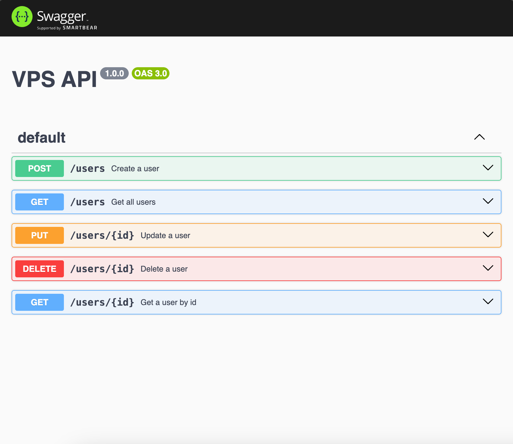

# Personal VPS Stack

It is a simple API backend application that uses the following technologies:

- Bun
- Bun SQLite
- Drizzle ORM
- Express
- Swagger UI Express



## Getting Started

To get started, clone this repository and run `bun install` to install the dependencies. Then, run `bun https.ts` to start the development server.

## Database

The database is a filesystem `sqlite.db` file.The database schema is located in the `db/schema.ts`.

### Migrations

This already created a migration file in the `drizzle/migrations` folder.
To run the migrations, run :

```bash
bun migrate.ts
```

## What's next ?

- TODO
